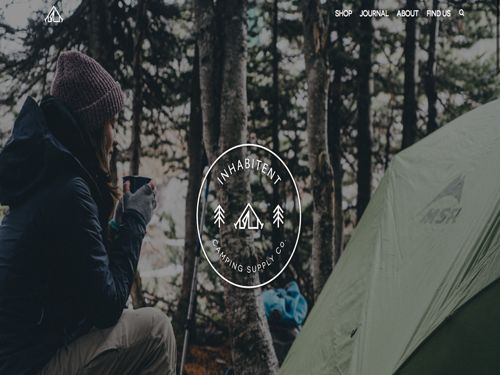

#Inhabitent Wordpress Theme

A WordPress starter theme for a fictitious camping supplies company.

#Installation

#Install the dev dependencies

Run npm install inside your theme directory next to install the node modules you'll need for Gulp, etc.

Update the proxy in gulpfile.js

Be sure to update your gulpfile.js with the appropriate URL for the Browsersync proxy (so change inhabitent.dev to the appropriate localhost URL).

#Stretch goals implemented

-Added dashicons to customize the CPT menu items in the WP admin menu
-Included a custom screenshot for my theme
-Styled the header differently on the About and Home pages. *Did not add jquery to make it appear
on scroll.

#Learning Outcomes

-Learned the importance of oragnizing SASS correctly from the beginning. I started by adding most of 
my new css to the bottom of the sass partial, and it came back to bite me again and again, because it made
things harder to find.

-Gained an understanding of how PHP  works, and its differences from JavaScript.  It's differences
in syntax, and how its embeded were hard to overcome, but in the end many of the similar skills
transfered over.

-Learned how to deal with a larger file structure. Makes me understand just how crucial being
organized is. Easy to read code is so much less stressful.

-Learned a lot about git, and the importance of committing constantly. I was able to solve a couple 
big problems, because I was able to compare the changes I did in a previous commit.

